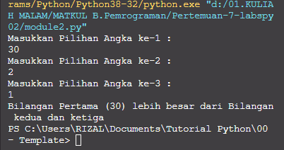
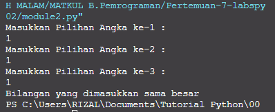

# Pertemuan-7-labspy02

Repositiry ini dibuat untuk memenuhi tugas Pertemuan 7 - Bahasa Pemrograman (Module Praktikum 2)<br><br>
Nama : Mohamad Farizal Arifin <br>
NIM : 312010231<br>
Dosen : Agung Nugroho, M.Kom
Matkul : Bahasa Pemrograman
Kelas : TI.20.B.1<br>

Pada halaman ini (Tugas Pertemuan-7-Module Praktikum 2) Dosen memberi tugas yaitu untuk membuat program sederhana dengan input tiga buah bilangan, dari ketiga bilangan
tersebut tampilkan bilangan terbesarnya. Gunakan statement if. Menggunakan Bahasa Pemrograman Python<br>

* Pada repository ini saya akan uraikan langkah atau algoritmanya serta Flowchart yang telah saya buat. file flowchart bisa klik link berikut <br>

Berikut source code yang saya tulis untuk membuat aplikasi tersebut.<br>
``` python
#membuat program module 2
print("Masukkan Pilihan Angka ke-1 : ")
xangka1 = int(input())
print("Masukkan Pilihan Angka ke-2 : ")
xangka2 = int(input())
print("Masukkan Pilihan Angka ke-3 : ")
xangka3 = int(input())

if (xangka1 > xangka2) and (xangka1 > xangka3):
    print(f"Bilangan Pertama ({xangka1}) lebih besar dari Bilangan kedua dan ketiga")
elif (xangka2 > xangka1) and (xangka2 > xangka3):
    print(f"Bilangan kedua ({xangka2}) lebih besar dari Bilangan pertama dan ketiga")
elif (xangka1 == xangka2) and (xangka1 == xangka3) and (xangka2 == xangka3):
    print("Bilangan yang dimasukkan sama besar")
else:
    print(f"Bilangan ketiga ({xangka3}) lebih besar dari Bilangan pertama dan kedua")
```
<br>

Berikut langkah-langkahnya : <br><br>

* Langkah pertama yaitu saya akan membuat sebuah inputan tersebut untuk menentukan angka terbesar. Yaitu dengan mengetik syntax berikut : <br>

```python
print("Masukkan Pilihan Angka ke-1 : ")
xangka1 = int(input())
print("Masukkan Pilihan Angka ke-2 : ")
xangka2 = int(input())
print("Masukkan Pilihan Angka ke-3 : ")
xangka3 = int(input())
```
<br>

* Langkah kedua yaitu menentukan logika untuk menemukan bilangan terbesar dari angka yang diinputkan.
Dengan menjelaskan fungsi-fungsi pada source code yang digunakan diatas : <br>
```python
if (xangka1 > xangka2) and (xangka1 > xangka3):
```

Syntax diatas berfungsi untuk melakukan pengecekan inputan pada **Angka ke-1**, yaitu dengan penggunaan **if**.<br>
```python
elif (xangka2 > xangka1) and (xangka2 > xangka3):
```
Pada syntax diatas melakukan pengecekan dengan 2 perbandingan angka terbesar yaitu *Apakah Angka ke-1 lebih besar dari Angka ke-2* dan *Apakah Angka ke-1 lebih besar dari Angka ke-3*. Dengan menggunakan perintah **AND**
Setelah melakukan pengecekan apakah Angka-1 sebegai bilangan terbesar atau tidak, sedangkan syntax dibawah adalah untuk mengetahui bahwa bilangan yang kita inputkan sama besar.
```python
elif (xangka1 == xangka2) and (xangka1 == xangka3) and (xangka2 == xangka3):
```
selanjutnya kita akan mengetik perintah/syntax untuk menampilkan hasilnya.
```python
print(f"Bilangan Pertama ({xangka1}) lebih besar dari Bilangan kedua dan ketiga")
```
```python
 print(f"Bilangan kedua ({xangka2}) lebih besar dari Bilangan pertama dan ketiga")
```
```python
 print("Bilangan yang dimasukkan sama besar")
```
```python
else:
    print(f"Bilangan ketiga ({xangka3}) lebih besar dari Bilangan pertama dan kedua")
```
Berikut hasil running dari source code diatas adalah seperti gambar dibawah<br>

<br>
Hasil jika bilangan yang diinputkan sama besar<br>
<br>
<br>

### Demikian penjelasan dari saya mengenai Tugas Bahasa Pemrograman Pertemuan-7 Module 2 yang diperintahkan oleh Dosen, Terima kasih...